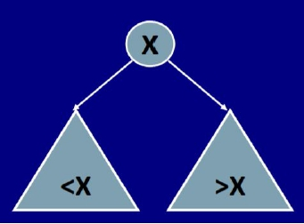

# Soal Tutorial

## Benny-ry\* Search Tree

\*no pun intended

Di dalam pemrograman, terdapat struktur data yang bernama Binary Search Tree.
Binary Search Tree adalah sebuah tree dimana setiap node dari tree memiliki
maksimal 2 child node, dan nilai child node di kiri selalu lebih kecil daripada
node nya dan child node di kanan selalu lebih besar daripada node nya.
Ilustrasinya seperti gambar di bawah ini, terdapat node bernilai x, maka
sebelah kirinya pasti memiliki nilai lebih kecil daripada x, dan sebelah
kanannya pasti memiliki nilai lebih besar daripada x.

  
Gambar 1 : Ilustrasi

Suatu hari, Benny sedang belajar untuk membuat program Binary Search Tree
generator. Tentu saja, pada awalnya Benny tidak langsung mengerti. Tapi setelah
beberapa hari, akhirnya dia berhasil membuat sebuah program Binary Search Tree
yang hampir sempurna. Lalu dia mencoba untuk memasukkan nilai-nilai ke dalam
tree tersebut. Hasilnya seperti ini:

  

Gambar 2 : Binary Search Tree

Pertama, Benny menambahkan 50 ke dalam tree, karena tree masih kosong, maka
dijadikan 50 sebagai root. Lalu dia menambahkan 40 ke dalam tree, 40
dibandingkan terhadap nilai 50, karena lebih kecil maka 40 menjadi left child
dari 50. Selanjutnya dia menambahkan nilai 45, kita lihat 45 lebih kecil dari
50, namun karena 50 sudah punya left child yang bernilai 40, maka 45
dibandingkan lagi dengan 40, karena lebih besar daripada 40, 45 menjadi right
child dari 40. Dan seterusnya.

Namun sangat disayangkan bahwa Benny harus menghadiri rapat terkait krisis
BenCoin, sehingga dia meminta anda untuk melengkapi fungsi untuk mencari sebuah
nilai di dalam tree. Sebagai mahasiswa Tarung yang ambisius, memiliki prioritas
tinggi terhadap akademis, dan jago ngodingnya, anda dapat melatih untuk
berpikir secara rekursif pada soal ini.

### Template

Terdapat template yang sudah disediakan. Kalian dapat menggunakannya dan
tinggal mengimplementasikan method `find_node` untuk mencari apakah nilai yang
dicari ada di dalam tree.  
Hint: Terdapat contoh untuk mengakses node pada program, seperti
`current_node.left` untuk mengakses left child dari suatu node

### Tips dan Trick

- Setiap rekursi mempunyai base case , coba tentukan base case terlebih dahulu.
- Setiap kasus dalam rekursi pada akhirnya akan mencapai base case, dengan
  begitu coba tentukan sebuah recursive case yang pasti akan mencapai base
  case.
- Kalau tidak mengerti apa yang harus dilakukan, langsung tanyakan!

#### Uji Kasus

| No  | Kasus                                                         |
| --- | ------------------------------------------------------------- |
| #1  | `Masukkan sebuah integer yang ingin dicari di dalam tree: 50` |
|     | `50 terdapat dalam tree`                                      |
| #2  | `Masukkan sebuah integer yang ingin dicari di dalam tree: 44` |
|     | `44 terdapat dalam tree`                                      |
| #3  | `Masukkan sebuah integer yang ingin dicari di dalam tree: 10` |
|     | `10 tidak ada dalam tree`                                     |
| #4  | `Masukkan sebuah integer yang ingin dicari di dalam tree: 90` |
|     | `90 terdapat dalam tree`                                      |

## Bonus

Kalian dapat mengimplementasikan fungsi tracing, dimana jika kalian mencari
sebuah nilai dan terdapat dalam tree, kalian dapat print node yang telah
dilewati oleh program saat menjalankan method rekursif dari root hingga node
yang dicari, dan jika tidak ada dalam tree, kalian tidak perlu print
tracingnya. Perlu diingat bahwa ini hanya bonus yang tidak wajib dikerjakan,
namun disarankan untuk mengerjakannya untuk melatih cara berpikir kalian.

#### Uji Kasus Bonus

| No  | Kasus                                                         |
| --- | ------------------------------------------------------------- |
| #1  | `Masukkan sebuah integer yang ingin dicari di dalam tree: 65` |
|     | `65 terdapat dalam tree`                                      |
|     | `Node yang dilewati : 50 60 75 65`                            |
| #2  | `Masukkan sebuah integer yang ingin dicari di dalam tree: 51` |
|     | `51 tidak ada dalam tree`                                     |

**JANGAN COBA-COBA (saat ini) UNTUK MENGGUNAKAN CARA ITERATIF KARENA HANYA AKAN
MEMPERSULIT DIRI SENDIRI (coba-coba di luar sesi lab aja ya)**

### Penilaian

- 85% Kebenaran (Program berjalan, kasus uji benar)
- 10% Kerapihan (Penamaan variabel jelas, mudah dibaca)
- 5% Dokumentasi (Comment pada bagian-bagian penting)
- 10% Bonus (Implementasi fitur bonus)

**TIDAK MENGGUNAKAN REKURSI AKAN MENYEBABKAN PENGURANGAN NILAI YANG SANGAT
SIGNIFIKAN**

**"Terdapat dua hal tidak tertulis yang harus dilakukan sebelum ngoding
rekursif, yaitu Paham dan Percaya" - Sang Bijaksana**

 

**ALD DHA GIL DST**

---

Diambil dari `Soal Tutorial Lab 10 - Kelas C` (Tutorial Lab 10 DDP1 C
\-- 20 Oktober 2017)
